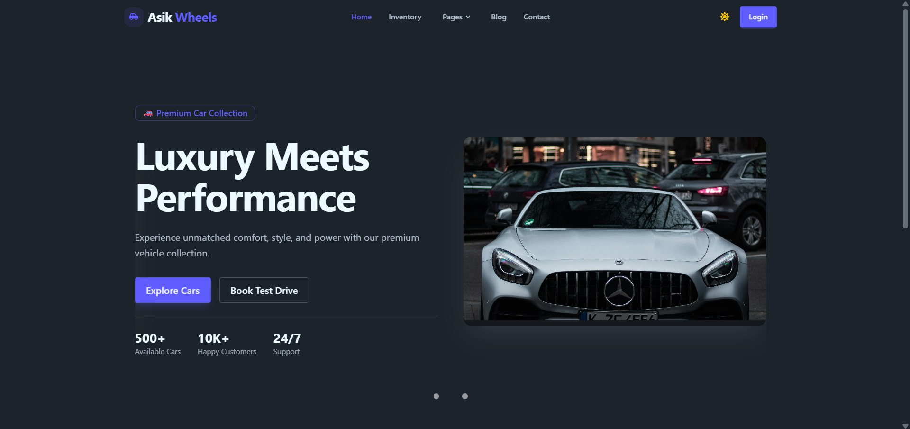
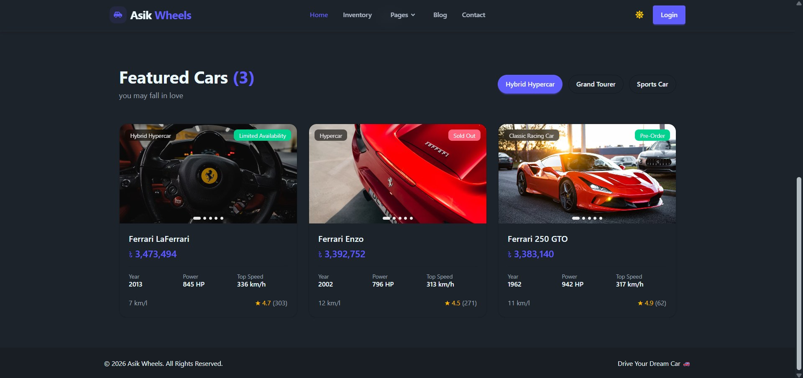
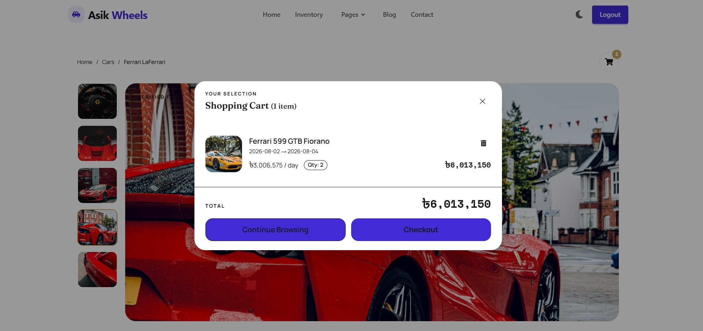
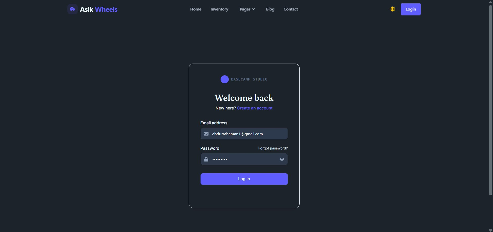

<div align="center">



<br /><br />

# 🚗 Asik Wheels
### Luxury Meets Performance — Premium Car Rental & Showcase Platform

A modern, full-stack car rental / showroom web app featuring live inventory, detailed vehicle specs, a shopping cart booking flow, and secure user authentication.

<br />

[](https://react.dev)
[](https://vitejs.dev)
[](https://tailwindcss.com)
[](https://reactrouter.com)

<br />

**[🌐 Live Demo](#)** &nbsp;·&nbsp; **[🐛 Report Bug](#)** &nbsp;·&nbsp; **[✨ Request Feature](#)**

</div>

<br />

---

## 📸 Preview

<table>
<tr>
<td width="50%">
  
  <p align="center"><sub><b>Featured Cars</b> — filterable inventory grid</sub></p>
</td>
<td width="50%">
  
  <p align="center"><sub><b>Car Details</b> — gallery view with booking cart</sub></p>
</td>
</tr>
<tr>
<td width="50%">
  
  <p align="center"><sub><b>Authentication</b> — secure login & signup</sub></p>
</td>
<td width="50%">
  
  <p align="center"><sub><b>Home</b> — hero section with stats</sub></p>
</td>
</tr>
</table>

<sub>📁 Screenshots live in <code>screenshots/</code> — swap the files anytime, no README edits needed.</sub>

<br />

---

## ✨ Features

<table>
<tr>
<td width="50%" valign="top">

**🚘 Inventory & Browsing**
- Featured Cars grid with category filters (*Hybrid Hypercar, Grand Tourer, Sports Car*, etc.)
- Per-car specs: year, power (HP), top speed, mileage, and user ratings
- Image gallery with thumbnail navigation on car detail pages
- Availability badges (*Sold Out*, *Limited Availability*, *Pre-Order*)

</td>
<td width="50%" valign="top">

**🔐 Booking & Accounts**
- Shopping cart with date-range selection and live total calculation
- Quantity-based booking with per-day pricing
- Email/password authentication (Login & Sign up)
- "Forgot password" recovery flow

</td>
</tr>
</table>

<table>
<tr>
<td width="50%" valign="top">

**🎨 UI/UX**
- Dark / Light theme toggle
- Fully responsive, mobile-first layout
- Clean card-based design with breadcrumb navigation

</td>
<td width="50%" valign="top">

**🧭 Navigation**
- Multi-page routing (Home, Inventory, Pages, Blog, Contact)
- Dynamic car detail routes (`/carsDetails/:id`)
- Protected checkout flow via `/auth`

</td>
</tr>
</table>

<br />

---

## 🛠️ Tech Stack

<table>
<tr><td><b>Framework</b></td><td>React</td></tr>
<tr><td><b>Build Tool</b></td><td>Vite</td></tr>
<tr><td><b>Styling</b></td><td>Tailwind CSS</td></tr>
<tr><td><b>Routing</b></td><td>React Router</td></tr>
<tr><td><b>State / Cart</b></td><td>React Context / State management for cart & auth</td></tr>
</table>

<sub>⚠️ Update this table to match your actual dependencies from <code>package.json</code>.</sub>

<br />

---

## 📁 Project Structure

```
car_website_client/
├── public/
│   └── screenshots/          # README preview images
├── src/
│   ├── assets/                 # Images, icons, media
│   ├── components/
│   │   ├── Hero.jsx
│   │   ├── FeaturedCars.jsx
│   │   ├── CarCard.jsx
│   │   ├── CarDetails.jsx
│   │   ├── Cart.jsx
│   │   ├── Auth.jsx
│   │   ├── Navbar.jsx
│   │   └── ...
│   ├── pages/                   # Route-level pages
│   │   ├── Home.jsx
│   │   ├── Inventory.jsx
│   │   ├── CarsDetails.jsx
│   │   ├── AuthPage.jsx
│   │   └── Contact.jsx
│   ├── context/                  # Cart / Auth context providers
│   ├── App.jsx
│   ├── main.jsx
│   └── index.css
├── vite.config.js
├── package.json
└── README.md
```

<sub>⚠️ Adjust this tree to match your actual folder layout.</sub>

<br />

---

## 🚦 Getting Started

### Prerequisites

- [Node.js](https://nodejs.org/) `v18+`
- [npm](https://www.npmjs.com/) `v9+` (or `yarn` / `pnpm`)

### Installation

```bash
# 1. Clone the repository
git clone https://github.com/<your-username>/car_website_client.git
cd car_website_client

# 2. Install dependencies
npm install

# 3. Run the development server
npm run dev
```

App runs at **`http://localhost:5174`**

<details>
<summary>Other commands</summary>
<br />

```bash
npm run build      # Build for production
npm run preview    # Preview the production build locally
npm run lint        # Run ESLint
```

</details>

<br />

---

## ⚙️ Environment Variables

If this project connects to a backend API or auth provider, create a `.env` file:

```env
VITE_API_BASE_URL=https://your-api-endpoint.com
VITE_AUTH_SECRET=your_key_here
```

> All Vite env variables **must** be prefixed with `VITE_` to be exposed to the client.

<br />

---

## 🎨 Customization

| What to change | Where |
|---|---|
| Site name, meta tags, favicon | `index.html` |
| Theme colors | `tailwind.config.js` |
| Hero content | `src/components/Hero.jsx` |
| Car inventory data | `src/components/FeaturedCars.jsx` (or API integration) |
| Cart logic | `src/context/CartContext.jsx` |
| Auth logic | `src/pages/AuthPage.jsx` |

<br />

---

## 🚀 Deployment

<table>
<tr>
<td valign="top" width="33%">

**▲ Vercel**
```bash
npm i -g vercel
vercel
```

</td>
<td valign="top" width="33%">

**◆ Netlify**
```bash
npm run build
# Drag & drop /dist
# or connect GitHub repo
```

</td>
<td valign="top" width="33%">

**◈ GitHub Pages**
```bash
npm run build
# Deploy /dist via
# gh-pages package
```

</td>
</tr>
</table>

<br />

---

## 🗺️ Roadmap

- [ ] Payment gateway integration for checkout
- [ ] Admin dashboard for inventory management
- [ ] Real backend API + database integration
- [ ] User booking history
- [ ] SEO optimization (meta tags, Open Graph, sitemap)

<br />

---

## 🤝 Contributing

Contributions, issues, and feature requests are welcome!

```bash
1. Fork the project
2. git checkout -b feature/AmazingFeature
3. git commit -m 'Add some AmazingFeature'
4. git push origin feature/AmazingFeature
5. Open a Pull Request
```

<br />

---

## 📄 License

Licensed under the **MIT License** — see [LICENSE](./LICENSE) for details.

<br />

---

<div align="center">

## 📬 Contact

Built by **Md Asik**

<a href="#"></a>
<a href="#"></a>
<a href="mailto:your.email@example.com"></a>

<br /><br />

⭐️ If you like this project, consider giving it a star!

</div>